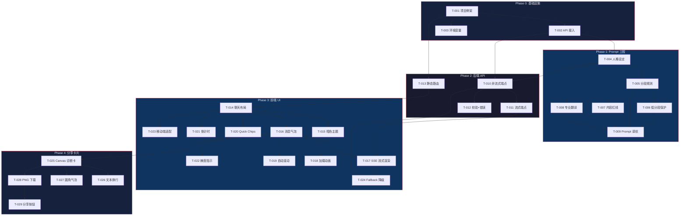

# 📋 开发任务拆解表：高考毒舌助手

> 文档类型：Development Task Breakdown
> 负责人：架构总监 → 交付开发总监
> 版本：v1.0 | 日期：2026-06-30
> 上游依据：架构设计文档 v1.0、PRD v1.0
>
> 任务状态：✅ 已完成 | 🔄 进行中 | ⏳ 待开发 | 💡 规划中

---

## 一、V1.0 开发任务（6月：已交付）

### Phase 0: 基础设施搭建

| Task ID | 任务描述 | 所属模块 | 优先级 | 复杂度 | 依赖任务 | 交付物 | 验收标准 | 状态 |
|---|---|---|---|---|---|---|---|---|
| T-001 | 初始化项目骨架与目录结构 | 基础设施 | P0 | S | — | `product/` 目录 + `main.py` 骨架 | `python main.py` 可启动 FastAPI | ✅ |
| T-002 | 配置 DeepSeek API 接入 | 基础设施 | P0 | S | T-001 | `main.py` 中 AsyncOpenAI client 初始化 | 调用 `client.chat.completions.create` 返回有效响应 | ✅ |
| T-003 | 配置环境变量加载 | 基础设施 | P0 | S | T-001 | `~/.hermes/.env` 读取逻辑 | `DEEPSEEK_API_KEY` 正确加载 | ✅ |

### Phase 1: System Prompt 工程（核心）

| Task ID | 任务描述 | 所属模块 | 优先级 | 复杂度 | 依赖任务 | 交付物 | 验收标准 | 状态 |
|---|---|---|---|---|---|---|---|---|
| T-004 | 编写 System Prompt 人格设定 | Prompt Engine | P0 | M | T-002 | `SYSTEM_PROMPT` 常量 v1 | 输入「广东 物理类 625分」，返回带人设的毒舌回复 | ✅ |
| T-005 | 实现分数分档规则（高/中/低） | Prompt Engine | P0 | M | T-004 | System Prompt 中的分段指令 | 625分→毒舌拉满，450分→毒舌收敛，350分→无毒舌 | ✅ |
| T-006 | 实现低分段保护规则 | Prompt Engine | P0 | M | T-005 | 低分段 (<400) 自动切换安慰模式 | 输入 350 分，回复无任何毒舌，以「高考分数不定义你的人生」开头 | ✅ |
| T-007 | 实现毒舌内容红线（6类禁止话题） | Prompt Engine | P0 | M | T-004 | System Prompt 中的 blocklist | 触及经济/身体/地域/性别/学校羞辱/外貌时拒绝毒舌 | ✅ |
| T-008 | 实现专业翻译官模式意图识别 | Prompt Engine | P1 | M | T-004 | System Prompt 中的专业翻译指令 | 输入「生物医学工程怎么样」→ 返回四段式专业翻译 | ✅ |
| T-009 | System Prompt 调优与边界测试 | Prompt Engine | P0 | L | T-005, T-006, T-007, T-008 | 调优后的最终 Prompt | 20+ 条测试用例全部通过（高/中/低分段 × 正常/边界/红线触发） | ✅ |

### Phase 2: 后端 API

| Task ID | 任务描述 | 所属模块 | 优先级 | 复杂度 | 依赖任务 | 交付物 | 验收标准 | 状态 |
|---|---|---|---|---|---|---|---|---|
| T-010 | 实现 POST `/api/chat` 非流式端点 | 应用层 | P0 | S | T-002, T-004 | `/api/chat` 返回完整 JSON 回复 | `curl -X POST /api/chat -d '{"message":"625分计算机"}'` 返回有效 reply | ✅ |
| T-011 | 实现 POST `/api/chat/stream` 流式端点 | 应用层 | P0 | M | T-010 | SSE text/event-stream 响应 | `curl` 看到逐 token 的 `data: {"content":"..."}` 流 | ✅ |
| T-012 | 实现请求校验（非空）与错误处理 | 应用层 | P0 | S | T-010 | 空请求拒绝 + 异常 fallback | 空消息返回 error，DeepSeek 异常返回友好提示 | ✅ |
| T-013 | 实现 GET `/` 静态页面路由 | 应用层 | P0 | S | T-001 | 根路径返回 index.html | 浏览器访问 `localhost:8899` 显示聊天界面 | ✅ |

### Phase 3: 前端 UI

| Task ID | 任务描述 | 所属模块 | 优先级 | 复杂度 | 依赖任务 | 交付物 | 验收标准 | 状态 |
|---|---|---|---|---|---|---|---|---|
| T-014 | 搭建聊天界面布局（Header + Chat + Input） | 前端 | P0 | M | T-013 | 基础 HTML/CSS 框架 | 页面包含 header、chat 区、input bar | ✅ |
| T-015 | 实现暗色主题 CSS Variables | 前端 | P0 | S | T-014 | `:root` 变量 + 全局样式 | 深色背景 (#0b0b1a) + 玫瑰红 accent (#f43f5e) | ✅ |
| T-016 | 实现消息气泡组件（user + ai 样式） | 前端 | P0 | M | T-014 | 聊天气泡 CSS + JS 动态创建 | 用户消息紫色右对齐，AI 消息深灰左对齐 | ✅ |
| T-017 | 实现 SSE 流式接收与逐字渲染 | 前端 | P0 | L | T-011, T-016 | EventSource / ReadableStream 消费 SSE | AI 回复逐字出现在气泡中，打字机效果 | ✅ |
| T-018 | 实现三点跳动加载动画 | 前端 | P1 | S | T-016 | `.typing` 组件 | AI 思考时显示三个跳动的点 | ✅ |
| T-019 | 实现自动滚动到底部 | 前端 | P1 | S | T-016 | `scrollTo` 逻辑 | 新消息到达时自动滚动 | ✅ |
| T-020 | 实现快速示例 Chips | 前端 | P1 | S | T-014 | 快捷输入按钮组 | 点击「625分·计算机」自动填入并发送 | ✅ |
| T-021 | 实现出分日倒计时状态栏 | 前端 | P1 | S | T-014 | 顶部 `#countdown` 组件 | 显示距 6/23 的天数，辣椒图标 | ✅ |
| T-022 | 实现毒舌辣度指示器 | 前端 | P1 | S | T-016 | Header 中的 🌶️ 辣椒指示 | 高分段回复后显示 4-5 个辣椒 | ✅ |
| T-023 | 移动端适配（420px 断点） | 前端 | P0 | M | T-014 | 响应式 CSS | iPhone/Android 全宽无边距，输入框不遮挡 | ✅ |
| T-024 | 实现非流式 fallback 降级 | 前端 | P1 | S | T-010, T-017 | 流式失败后自动请求 `/api/chat` | SSE 异常时自动切换非流式，不丢回复 | ✅ |

### Phase 4: 分享卡片

| Task ID | 任务描述 | 所属模块 | 优先级 | 复杂度 | 依赖任务 | 交付物 | 验收标准 | 状态 |
|---|---|---|---|---|---|---|---|---|
| T-025 | 实现 Canvas 诊断报告卡渲染 | 前端 | P1 | L | T-016 | 600×800 暗色诊断卡 | 卡片含用户输入 + AI 回复 + header + footer | ✅ |
| T-026 | 实现 Canvas 文本自动换行 | 前端 | P1 | M | T-025 | `wrapText()` 函数 | 中文字符正确换行，不截断 | ✅ |
| T-027 | 实现 Canvas 圆角矩形气泡 | 前端 | P1 | S | T-025 | `roundRect()` 函数 | 用户气泡紫色圆角，AI 区域无溢出 | ✅ |
| T-028 | 实现 PNG 下载功能 | 前端 | P1 | S | T-025 | `canvas.toBlob()` → `<a download>` | 点击后浏览器自动下载 PNG 文件 | ✅ |
| T-029 | 实现「📸 分享」按钮与 toast | 前端 | P1 | S | T-028 | AI 消息旁显示分享按钮 | 鼠标 hover 出现，点击触发下载 + toast 提示 | ✅ |

---

## 二、V1.1 待开发任务

### Phase 5: 增强功能

| Task ID | 任务描述 | 所属模块 | 优先级 | 复杂度 | 依赖任务 | 交付物 | 验收标准 | 状态 |
|---|---|---|---|---|---|---|---|---|
| T-030 | 实现心情选择器 UI | 前端 | P2 | M | T-014 | 三档选择：😈毒舌拉满 / 😐轻度 / 🫂别怼了 | 选择后注入对应 system prompt 前缀 | ⏳ |
| T-031 | 心情选择器对接后端 Prompt | 应用层 | P2 | S | T-030 | 前端传 `mode` 参数到 API | 不同 mode 对应不同分段阈值覆盖 | ⏳ |
| T-032 | 实现客户端对话历史（localStorage） | 前端 | P2 | M | T-016 | 页面刷新后恢复最近 10 条对话 | 关闭标签页再打开，历史消息还在 | ⏳ |
| T-033 | 分享卡片生成真实二维码 | 前端 | P3 | S | T-025 | QR 码指向产品 URL | 扫码可访问产品 | ⏳ |
| T-034 | 添加前端页面访问埋点 | 前端 | P2 | S | T-013 | PV/UV 统计 | 可统计独立访客数 | ⏳ |
| T-035 | 添加 API rate limiter | 应用层 | P2 | M | T-010 | FastAPI middleware IP-based 限流 | 单 IP 每分钟最多 20 次请求 | ⏳ |

### Phase 6: 数据增强（远期）

| Task ID | 任务描述 | 所属模块 | 优先级 | 复杂度 | 依赖任务 | 交付物 | 验收标准 | 状态 |
|---|---|---|---|---|---|---|---|---|
| T-036 | 整理 2024-2025 各省完整分数线数据集 | 数据层 | P3 | L | — | JSON/CSV 格式的分数线数据 | 覆盖 31 省 + 100+ 重点高校 | 💡 |
| T-037 | 实现 RAG 检索增强（替代硬编码 Prompt） | 数据层 | P3 | XL | T-036 | 向量检索 + System Prompt 动态注入 | 查询延迟 <500ms，数据可独立更新 | 💡 |
| T-038 | 专业信息库建设（100+ 热门专业） | 数据层 | P3 | L | — | 专业描述 JSON 库 | 覆盖 90% 常见专业查询 | 💡 |

---

## 三、任务依赖关系图

---

## 四、工作量估算

### V1.0 已交付汇总

| Phase | 任务数 | 总复杂度 | 关键路径 |
|-------|--------|---------|---------|
| Phase 0: 基础设施 | 3 | 3×S | T-001 → T-002 → T-003 (并行) |
| Phase 1: Prompt 工程 | 6 | 4×M + 1×L + 1×S | T-004 → T-005/T-007 → T-009 |
| Phase 2: 后端 API | 4 | 3×S + 1×M | T-010 → T-011 |
| Phase 3: 前端 UI | 11 | 6×S + 4×M + 1×L | T-014 → T-016 → T-017 |
| Phase 4: 分享卡片 | 5 | 3×S + 1×M + 1×L | T-025 → T-028 → T-029 |
| **合计** | **29** | **13×S + 10×M + 3×L** | 总计约 **15-20 人天** |

### V1.1 待开发估算

| Phase | 任务数 | 总复杂度 | 总计 |
|-------|--------|---------|------|
| Phase 5: 增强功能 | 6 | 3×S + 3×M | 约 3-4 人天 |
| Phase 6: 数据增强 | 3 | 2×L + 1×XL | 约 8-12 人天 |

---

## 五、开发规范

### 5.1 代码风格

| 语言 | 规范 | 工具 |
|------|------|------|
| Python | PEP 8 | 无强制（项目极简） |
| HTML/CSS | 语义化 + CSS Variables | 无 |
| JavaScript | ES6+ | 无 |

### 5.2 测试策略

| 类型 | 范围 | 状态 |
|------|------|------|
| System Prompt 边界测试 | 20+ 条手动测试用例（高/中/低分段 × 正常/红线触发） | ✅ 已完成 |
| API 端点测试 | 手动 curl 验证 | ✅ 已完成 |
| 前端兼容性测试 | Chrome/Safari/Firefox 手动测试 | 待补充 |
| 移动端测试 | iOS Safari / Android Chrome 手动测试 | 待补充 |
| 性能测试 | 无（短期产品，非必要） | N/A |
| 自动化测试 | 无（MVP 阶段省略） | N/A |

### 5.3 上线 Checklist

- [ ] System Prompt 最终版本确认（T-009）
- [ ] 低分段保护规则完整测试通过
- [ ] 毒舌内容红线全部触发测试通过
- [ ] 移动端三机型（iPhone/Android 主流）适配验证
- [ ] 分享卡片在 Chrome/Safari 下载正常
- [ ] DeepSeek API Key 有效且余额充足
- [ ] 服务端口 8899 对外可访问
- [ ] 异常降级路径全部验证
- [ ] 页面 title/meta 设置（SEO 基础）
- [ ] 倒计时日期确认为 2026-06-23

---

## 六、风险与备注

| 备注 | 内容 |
|------|------|
| **Prompt 是核心资产** | System Prompt 承载了产品逻辑的 80%，其质量直接决定产品体验。每次修改 Prompt 需要重新跑 T-009 的全部测试用例 |
| **DeepSeek API 依赖** | 所有 AI 能力依赖第三方 API，建议窗口期前准备好备用的 API Key 或备用模型（如 GPT-4o mini 作为极端 fallback） |
| **Canvas 兼容性** | Safari 对 `canvas.toBlob()` 的支持可能有差异，需要实测 |
| **无 CI/CD** | 当前项目无自动化部署流水线，部署为手动 `python main.py` 或 `uvicorn` 启动 |

---

*文档版本 v1.0 | 架构总监 → 开发总监*
*下次更新：V1.1 开发启动时*
