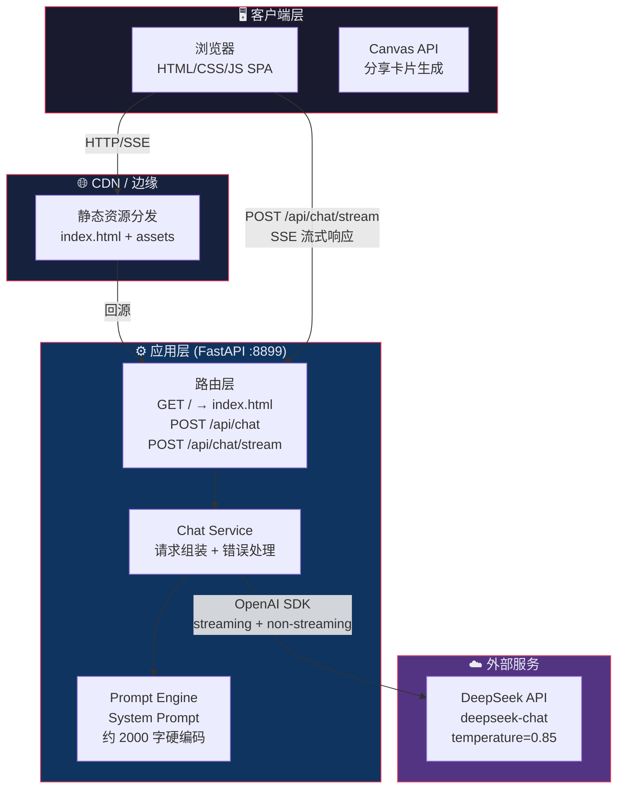
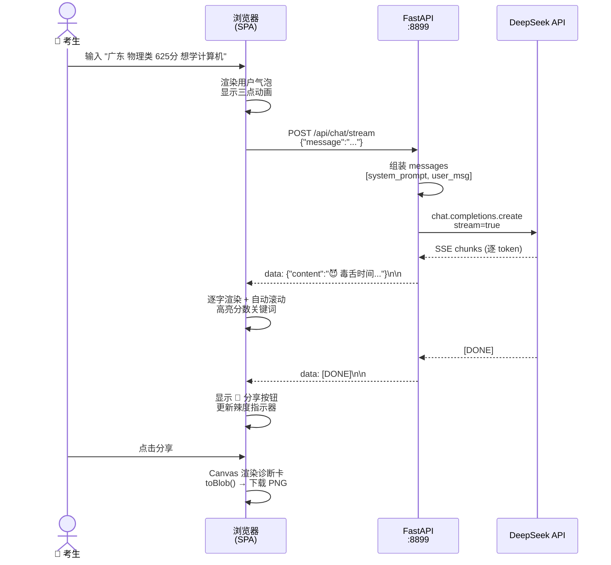
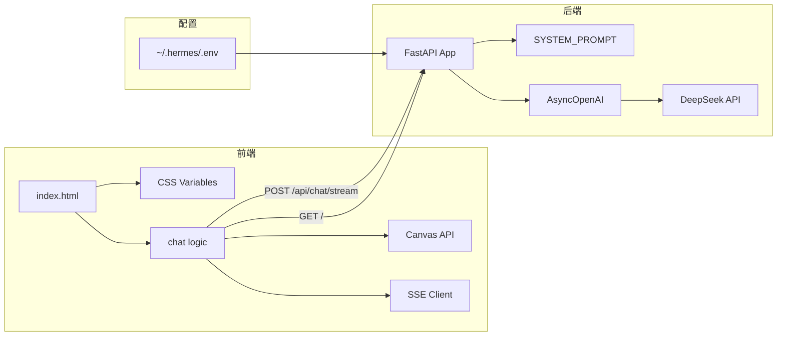
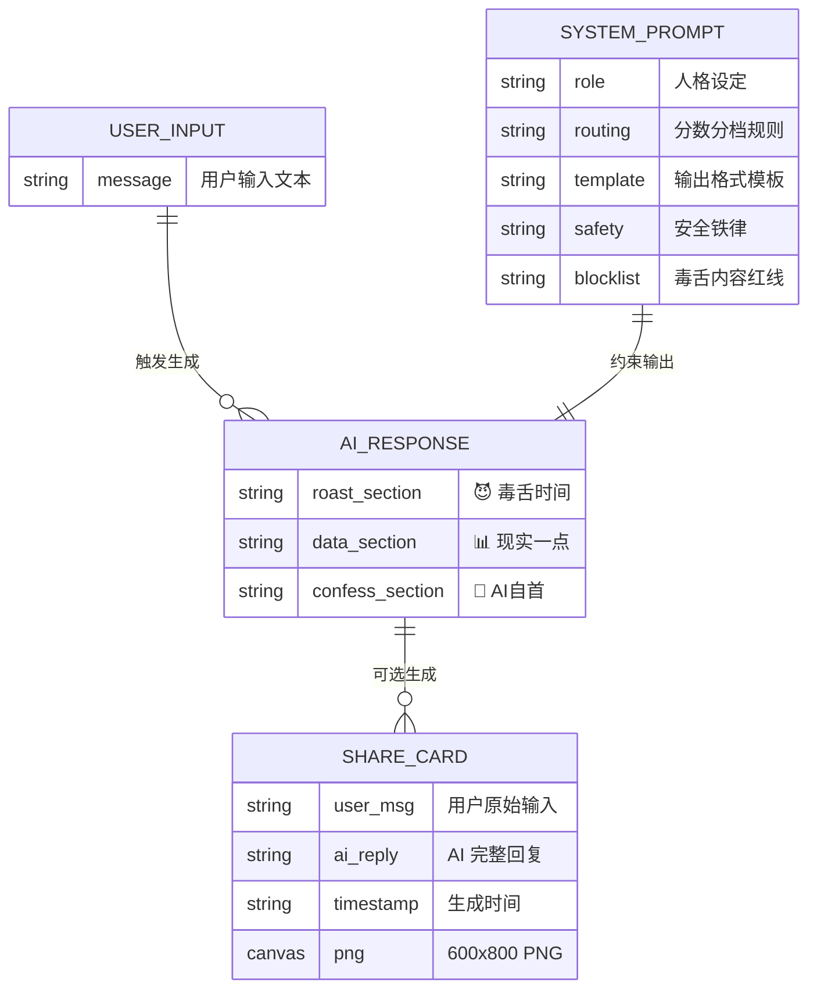
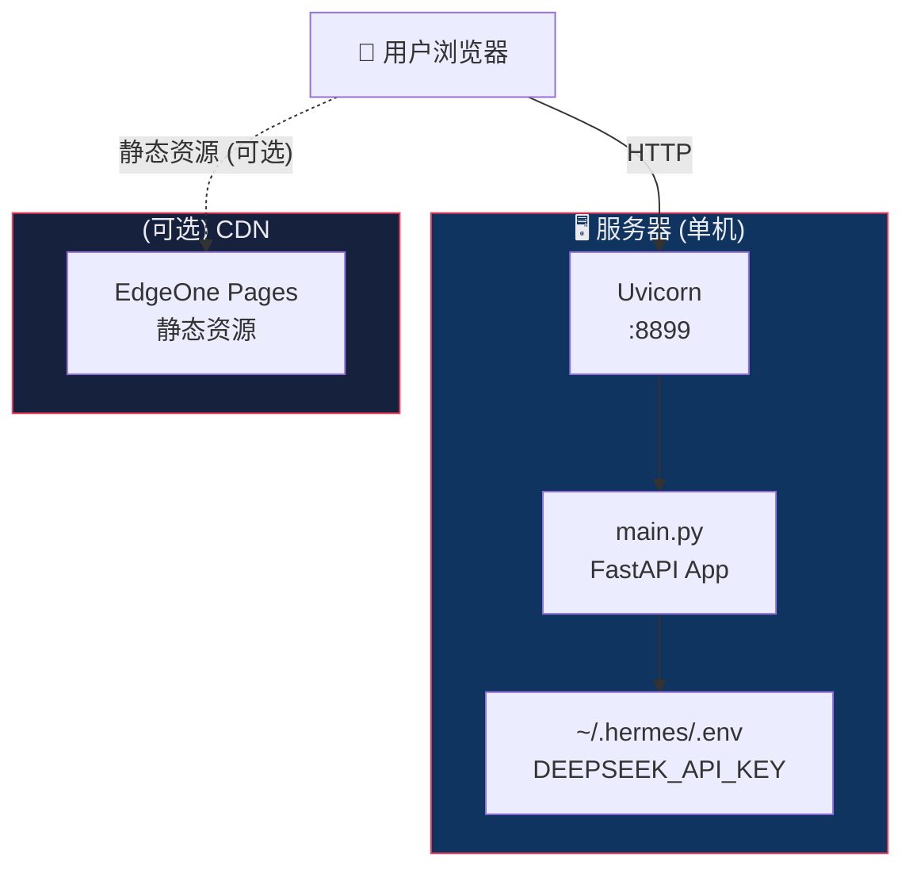

# 🏗️ 架构设计文档：高考毒舌助手

> 文档类型：Architecture Design Document
> 负责人：架构总监
> 版本：v1.0 | 日期：2026-06-30
> 上游依据：PRD v1.0、现有代码实现 product/main.py、product/static/index.html

---

## 1. 架构概述

### 1.1 一句话架构定位

> **单体 FastAPI 应用，以 DeepSeek API 为 AI 引擎，通过精心设计的 System Prompt 实现核心产品逻辑，前端为纯静态 HTML/CSS/JS 的单页面聊天应用。**

### 1.2 顶层架构图



### 1.3 请求流向（时序）



---

## 2. 技术选型

### 2.1 选型总览

| 层 | 技术 | 版本 | 角色 |
|----|------|------|------|
| **运行时** | Python 3 | 3.x | 后端运行环境 |
| **Web 框架** | FastAPI | latest | HTTP + SSE 服务 |
| **ASGI Server** | Uvicorn | latest | 生产级 ASGI |
| **AI SDK** | openai (Python) | latest | DeepSeek API 调用 |
| **HTTP Client** | httpx | latest | 带超时的异步 HTTP |
| **前端框架** | 无框架（Vanilla JS） | — | 轻量 SPA |
| **样式** | 纯 CSS（CSS Variables） | — | 暗色主题 |
| **Canvas** | 浏览器原生 Canvas API | — | 分享卡片生成 |
| **AI 模型** | DeepSeek Chat | deepseek-chat | 毒舌文本生成 |
| **配置管理** | python-dotenv | latest | 从 ~/.hermes/.env 读取 API Key |
| **部署** | 裸机进程 / systemd | — | 单进程，端口 8899 |

### 2.2 关键选型决策

#### 2.2.1 前端：Vanilla JS vs React（ADR-001）

| 维度 | Vanilla JS（✅ 选用） | React + TypeScript + Vite（原计划） |
|------|---------------------|----------------------------------|
| **构建复杂度** | 零构建，直接部署 | 需 Vite 构建链 + node_modules |
| **体积** | ~22KB 单文件 | ~200KB+ gzip 后 |
| **开发速度** | 极快（单文件 SPA） | 需组件拆分 + 状态管理 |
| **可维护性** | 500行代码内可控 | 复杂项目才体现优势 |
| **移动端适配** | CSS 直写，无框架包袱 | 需额外配置 |

> **决策**：本项目 UI 复杂度低（1个页面、1个输入框、聊天流、1个 Canvas），Vanilla JS 足够。React 的组件化和状态管理优势在此场景下是过度工程。
>
> **Trade-off**：牺牲了组件复用性，换取了极致的部署简单和零依赖。如果产品扩展为多页面应用，需要重构为 React。

#### 2.2.2 AI 模型：DeepSeek vs 其他

| 维度 | DeepSeek（✅ 选用） | GPT-4o | Claude 3.5 |
|------|-------------------|--------|------------|
| **中文能力** | ⭐⭐⭐⭐⭐ 母语级 | ⭐⭐⭐⭐ | ⭐⭐⭐⭐ |
| **角色扮演/毒舌** | ⭐⭐⭐⭐⭐ 语气自然 | ⭐⭐⭐⭐ | ⭐⭐⭐ |
| **成本** | ¥2/1M tokens | ¥70/1M tokens | ¥70/1M tokens |
| **API 稳定性** | 一般（偶有波动） | 高 | 高 |
| **速率限制** | 较宽松 | 分层限速 | 分层限速 |

> **决策**：DeepSeek 中文角色扮演能力与项目「毒舌人设」高度匹配，且成本仅为 GPT-4o 的 1/35，适合高并发窗口期。
>
> **Trade-off**：牺牲了 API 稳定性的冗余度，通过非流式 fallback 和友好错误提示缓解。

#### 2.2.3 Prompt 策略：硬编码 System Prompt vs RAG

| 维度 | 硬编码 System Prompt（✅ 选用） | RAG 检索增强 |
|------|------------------------------|------------|
| **延迟** | 0ms 额外延迟 | +200-500ms 检索+上下文注入 |
| **复杂度** | 极低（字符串） | 需要向量数据库 + Embedding |
| **数据新鲜度** | 手动更新 | 自动检索最新数据 |
| **可维护性** | 修改即生效 | 需要重建索引 |

> **决策**：高考分数线数据变化频率极低（每年一次），且数据量小（几十所学校 × 几个省份），内嵌到 System Prompt 中即可。RAG 带来的额外延迟和复杂度在此场景下不值得。
>
> **Trade-off**：牺牲了数据动态更新能力，但这些数据不需要动态更新——每次高考只有一份分数线。

#### 2.2.4 存储：无状态 vs 数据库

| 维度 | 无状态（✅ 选用） | 数据库 |
|------|-----------------|--------|
| **复杂度** | 零 | 需要 PostgreSQL/Redis |
| **运维成本** | 零 | 需要备份/监控/迁移 |
| **用户价值** | 单轮对话足够 | 多轮对话/历史记录 |

> **决策**：产品定位为「单轮毒舌吐槽」，每次输入独立处理，不需要上下文。且不存储用户数据可规避数据隐私合规风险。
>
> **Trade-off**：牺牲了对话历史持久化能力。V1.1 可考虑 localStorage 做客户端级历史记录。

---

## 3. 系统分层

### 3.1 分层架构

```
┌────────────────────────────────────────┐
│           表现层 (Presentation)         │
│  index.html (22KB)                     │
│  ├── CSS Variables 暗色主题             │
│  ├── Chat UI (消息气泡、打字动画)       │
│  ├── Canvas 分享卡片                    │
│  └── SSE Client (流式解码)              │
├────────────────────────────────────────┤
│           应用层 (Application)          │
│  main.py (187行)                       │
│  ├── FastAPI Router                    │
│  │   ├── GET  /           → index.html │
│  │   ├── POST /api/chat   → 非流式响应  │
│  │   └── POST /api/chat/stream → SSE   │
│  ├── ChatService (内联)                │
│  │   ├── 请求校验 (非空)                │
│  │   ├── System Prompt 注入            │
│  │   └── 错误处理 + Fallback            │
│  └── PromptEngine (内联)               │
│      └── SYSTEM_PROMPT 常量 (2KB)       │
├────────────────────────────────────────┤
│           集成层 (Integration)          │
│  ├── OpenAI SDK (AsyncOpenAI)          │
│  ├── httpx.AsyncClient (timeout=60s)   │
│  └── python-dotenv (配置加载)           │
├────────────────────────────────────────┤
│           基础设施层 (Infrastructure)    │
│  ├── Python 运行时                     │
│  ├── Uvicorn ASGI Server               │
│  └── ~/.hermes/.env (API Key)          │
└────────────────────────────────────────┘
```

### 3.2 层间通信

```
前端 ↔ 后端
  通信方式: HTTP/1.1 + SSE
  数据格式: JSON (请求) / SSE text/event-stream (响应)
  端口: 8899
  
后端 ↔ DeepSeek
  通信方式: HTTPS
  SDK: OpenAI Python SDK (兼容接口)
  超时: 60s
  
无层间内部通信 (单体应用, 无微服务)
```

---

## 4. 模块分解

### 4.1 模块一览

| 模块 | 文件 | 语言 | 行数 | 职责 |
|------|------|------|------|------|
| **入口路由** | `main.py` L120-122 | Python | 3 | GET `/` → index.html |
| **聊天 API** | `main.py` L125-148 | Python | 24 | POST `/api/chat` 非流式 |
| **流式 API** | `main.py` L151-182 | Python | 32 | POST `/api/chat/stream` SSE |
| **System Prompt** | `main.py` L30-117 | Python | 88 | 毒舌人设 + 分段规则 + 安全约束 |
| **配置加载** | `main.py` L14-16 | Python | 3 | dotenv → API Key |
| **前端 UI** | `index.html` L1-264 | HTML/CSS | 264 | 布局 + 样式 |
| **前端逻辑** | `index.html` L269-639 | JS | 371 | 聊天流 + SSE + Canvas |
| **Canvas 分享** | `index.html` L312-418 | JS | 106 | 诊断卡渲染 + PNG 导出 |

### 4.2 Prompt Engine 架构（核心）

```
SYSTEM_PROMPT 结构：
┌──────────────────────────────────┐
│ 1. 人格设定 (role)               │
│    - 毒舌但善良                   │
│    - 数据驱动                     │
│    - 自嘲式免责                   │
├──────────────────────────────────┤
│ 2. 分数分档规则 (routing)        │
│    - 🔴 <400  → 安慰模式         │
│    - 🟡 400-480 → 收敛模式       │
│    - 🟢 ≥480 → 毒舌拉满模式      │
├──────────────────────────────────┤
│ 3. 输出格式模板 (template)       │
│    - 😈 毒舌时间 (1-3句)         │
│    - 📊 现实一点 (冲/稳/保)       │
│    - 🤖 AI自首 (自嘲收尾)         │
├──────────────────────────────────┤
│ 4. 安全铁律 (hard constraints)   │
│    - 吐槽分数不吐槽人             │
│    - 有数据才说，没数据坦白       │
│    - 永远加最终决定提醒            │
├──────────────────────────────────┤
│ 5. 毒舌内容红线 (blocklist)      │
│    - 经济/身体/地域/性别/         │
│      学校羞辱/外貌 绝对禁止       │
├──────────────────────────────────┤
│ 6. 专业翻译官模式                  │
│    - 意图识别规则                 │
│    - 输出格式模板                  │
├──────────────────────────────────┤
│ 7. 语气要求                       │
│    - 像朋友吐槽，不像教导主任      │
│    - 节奏快不废话                 │
│    - 每句话有信息量               │
└──────────────────────────────────┘
```

> **设计意图**：将所有产品逻辑（分段、安全、格式）编码在 System Prompt 中，AI 模型本身承担了「路由 + 格式 + 审核」三重职责。这是有意为之的设计——让模型自己处理分支逻辑，而非在代码层做 if/else。
>
> **风险**：依赖模型遵从 System Prompt 的能力。DeepSeek 在角色扮演类 prompt 上表现稳定，但边界 case（如用户刻意 prompt injection）需持续测试。

### 4.3 依赖关系



---

## 5. 数据架构

### 5.1 数据模型

> **本项目为无状态应用，没有持久化数据模型。** 以下是逻辑数据流。



### 5.2 数据流（仅内存，无持久化）

```
用户消息 → FastAPI Request Body → 
  [组装 messages: system_prompt + user_msg] → 
  DeepSeek API → 
  [流式 tokens] → 
  SSE Response → 
  [前端拼接] → 
  DOM 渲染 + Canvas 导出
```

### 5.3 无存储的架构决策

| 问题 | 决策 | 理由 |
|------|------|------|
| 对话历史 | 不存储 | 单轮对话，关闭即消失 |
| 用户数据 | 不存储 | 规避隐私合规风险 |
| 分数线数据 | 硬编码在 System Prompt | 低频更新，无需数据库 |
| 分享卡片 | 浏览器端生成，本地下载 | 不经过服务器 |
| API Key | ~/.hermes/.env | 环境变量隔离 |

> **仅有的「状态」**：客户端 JS 变量 `lastUserMsg`（用于分享卡片上下文），页面刷新即丢失。

---

## 6. 接口设计

### 6.1 API 端点

#### GET `/`

返回静态 HTML 页面。

| 属性 | 值 |
|------|-----|
| Method | GET |
| Response | `text/html` (index.html) |
| Auth | 无 |

---

#### POST `/api/chat`

非流式聊天（主要用作 fallback）。

| 属性 | 值 |
|------|-----|
| Method | POST |
| Content-Type | `application/json` |
| Auth | 无 |

**Request Body**:
```json
{
  "message": "广东 物理类 625分 想学计算机"
}
```

**Response (200)**:
```json
{
  "reply": "😈 毒舌时间\n625分想冲华科计算机？..."
}
```

**Response (Error)**:
```json
{
  "error": "...",
  "reply": "😅 毒舌AI今天嗓子哑了，请稍后再试..."
}
```

---

#### POST `/api/chat/stream`

流式聊天（主路径，打字机效果）。

| 属性 | 值 |
|------|-----|
| Method | POST |
| Content-Type | `application/json` |
| Response | `text/event-stream` (SSE) |
| Auth | 无 |

**Request Body**: 同 `/api/chat`

**SSE Response**:
```
data: {"content":"😈"}\n\n
data: {"content":" 毒舌"}\n\n
data: {"content":"时间"}\n\n
...
data: [DONE]\n\n
```

**Error SSE**:
```
data: {"error":"..."}\n\n
```

### 6.2 鉴权策略

**当前：无鉴权。**

> **决策理由**：产品定位为公开引流工具，不涉及用户账户/个人信息/支付。无鉴权最大化访问便利性，降低使用摩擦。
>
> **风险**：无鉴权意味着任何人都可以调用 API，存在被刷量风险。缓解措施：
> 1. 产品短期运营（13天核心窗口），被持续攻击概率低
> 2. DeepSeek API 自带速率限制
> 3. 如需防护，可在 FastAPI 前加一层 Nginx `limit_req`
>
> **TODO (V1.1)**：如果被恶意调用，加 simple rate limiter（IP-based, FastAPI middleware）。

---

## 7. 非功能设计

### 7.1 性能

| 指标 | 目标 | 实现方案 |
|------|------|---------|
| 首字节时间 (TTFB) | <500ms | 静态 HTML 直出，无 SSR |
| 流式首 token 延迟 | <2s | DeepSeek API 延迟为主，非可控 |
| 完整回复时间 | <10s | max_tokens=1024，约 8-15s |
| 并发能力 | 10 QPS | 单进程 FastAPI + 异步 I/O |
| 静态资源体积 | ~22KB | 单文件 HTML，无外部依赖（除 Google Fonts） |

**瓶颈分析**：
- 主导延迟是 DeepSeek API 的网络延迟 + 模型推理时间
- 后端处理开销极小（<10ms）
- 如遇高并发，FastAPI 异步模型可支撑，但受限于 DeepSeek API 的并发限制

### 7.2 安全

| 层面 | 措施 | 优先级 |
|------|------|--------|
| **AI 安全** | System Prompt 硬约束：6 类红线话题禁止毒舌 | P0 |
| **AI 安全** | 低分段 (<400) 毒舌全面关闭 | P0 |
| **输入安全** | 非空校验（空字符串拒绝） | P1 |
| **输入安全** | 无 SQL 注入风险（无数据库） | N/A |
| **输入安全** | 无 XSS 风险（前端 innerHTML 但无用户生成 UGC 展示给其他用户） | P2 |
| **传输安全** | 本地 HTTP（非生产 HTTPS），如部署公网需 HTTPS | P1 |
| **API Key** | 存储在 ~/.hermes/.env，不入库 | P0 |
| **速率限制** | 当前无（TODO V1.1） | P2 |

### 7.3 可扩展性

| 维度 | 当前状态 | 扩展方向 |
|------|---------|---------|
| **水平扩展** | 单进程 | FastAPI 天然支持多 worker（uvicorn --workers） |
| **数据扩展** | 硬编码分数线 | → V1.1 RAG 检索，数据与代码解耦 |
| **功能扩展** | 2个端点 | → 新增端点不影响现有 |
| **前端扩展** | Vanilla JS 单文件 | → 如需多页面或多组件，迁移到 React |
| **地域扩展** | 单服务器 | → EdgeOne CDN 分发静态资源 |

### 7.4 容灾与降级

```
主路径: POST /api/chat/stream → SSE 流式返回
         ↓ (失败)
降级 1: POST /api/chat → 非流式返回
         ↓ (失败)
降级 2: 前端显示 "😅 毒舌AI今天嗓子哑了，请稍后再试..."

DeepSeek API 不可用时:
  → 前端展示友好错误 + 手动重试按钮（当前为自动重试）

服务器宕机时:
  → 无（单体应用，无 HA 方案）
  → 可接受（产品为短期运营的引流工具，非 7×24 关键服务）
```

### 7.5 监控与日志

| 需求 | 方案 |
|------|------|
| 错误日志 | uvicorn 标准输出（stderr） |
| API 调用统计 | 可加 FastAPI middleware 记录请求数/延迟 |
| DeepSeek 调用量 | DeepSeek 控制台 dashboard |
| 前端埋点 | 当前无（TODO: 可加简单的页面访问计数） |

> **决策**：不上 Prometheus/Grafana 等重型监控。短期运营产品，uvicorn 日志 + DeepSeek dashboard 足以覆盖。

---

## 8. 部署架构

### 8.1 环境划分

| 环境 | 用途 | 配置 |
|------|------|------|
| **Local** | 开发调试 | `python main.py` → localhost:8899 |
| **Production** | 对外服务 | `uvicorn main:app --host 0.0.0.0 --port 8899` |

> 无 staging 环境（产品极简，未经 CI/CD 流水线，手动部署。）

### 8.2 部署拓扑



### 8.3 启动命令

```bash
# 开发模式
cd /home/highhighhopes/highProjects/PersonalAssistant/BuildInBilibili_JH/gaokaodushezhushou/product
python main.py
# → Uvicorn running on http://0.0.0.0:8899

# 生产模式 (建议)
uvicorn main:app --host 0.0.0.0 --port 8899 --workers 2 --log-level info
```

### 8.4 依赖管理

```
Python 依赖（requirements.txt）:
  fastapi
  uvicorn[standard]
  openai
  httpx
  python-dotenv

前端依赖: 无（Vanilla JS + 内联 CSS）
```

### 8.5 原计划 vs 实际部署

| 维度 | 原计划（产品方案 v2） | 实际实现 |
|------|---------------------|---------|
| 前端框架 | React + TypeScript + Vite | Vanilla HTML/CSS/JS 单文件 |
| 部署平台 | EdgeOne Pages + SCF (Serverless) | 裸机 Uvicorn 进程 |
| 复杂度 | 前端构建链 + Serverless 配置 | `python main.py` 一行启动 |
| 原因 | 计划为全功能产品 | 实际极简 MVP，单文件足够 |

> **ADR-002**：从 Serverless 降级为裸机进程。Serverless 冷启动延迟 + 配置复杂度对 MVP 来说过度。裸机进程启动即用，对 13 天窗口足够了。

---

## 9. 技术风险评估

| # | 风险 | 概率 | 影响 | 缓解方案 | 降级策略 |
|---|------|------|------|---------|---------|
| R1 | DeepSeek API 不可用/限流 | 中 | 高 | 前端自动 fallback 到非流式 | 显示友好错误 + 稍后重试 |
| R2 | AI 输出越狱（绕过安全红线） | 低 | 高 | System Prompt 多层防御 + 6 类话题硬约束 | 持续测试边界 case |
| R3 | 高并发打垮单进程 | 低 | 中 | FastAPI 异步 I/O 天然抗并发 | 加 worker 数或前面加 Nginx 限流 |
| R4 | 分数线数据过时导致错误推荐 | 中 | 中 | System Prompt 内嵌「2025 年数据，仅供参考」声明 | AI 自首段强化免责 |
| R5 | 服务器宕机 | 低 | 中 | 单机无 HA | 可接受（非 7×24 服务） |
| R6 | System Prompt token 超限 | 低 | 低 | 当前约 2000 tokens，DeepSeek 上下文 64K | 足够余量 |
| R7 | Canvas 分享在某些浏览器不兼容 | 低 | 低 | Canvas API 是现代浏览器标配 | toast 提示 + 手动截图提示 |

### 9.1 风险热力图

```
      高影响  │  R1 ●        │
              │  R2 ●        │
              │              │
      中影响  │  R4 ●  R3 ●  │  R5 ●
              │              │
      低影响  │  R7 ●  R6 ●  │
              │              │
              └──────────────┴──────────
              低概率          高概率
```

---

## 10. 架构决策记录 (ADR)

### ADR-001: 前端技术选型 — Vanilla JS 替代 React

**背景**：产品方案 v2 计划使用 React + TypeScript + Vite，但实际 UI 复杂度低于预期（单页面、一个输入框、聊天流、一个 Canvas）。

**决策**：使用 Vanilla HTML/CSS/JS 单文件实现前端。

**后果**：
- ✅ 零构建链、零 node_modules、部署极简
- ✅ 22KB 单文件，加载极快
- ✅ 开发速度极快（无需组件拆分）
- ❌ 无法复用 UI 组件
- ❌ 如果产品扩展为多页面应用，需要重构

**备选方案被拒绝**：
- React + TypeScript + Vite：过度工程，构建链负载 > 产品复杂度
- Vue.js：与 React 同理，额外依赖无收益
- Svelte：编译型框架，仍需构建链

### ADR-002: 部署方式 — 裸机进程替代 Serverless

**背景**：产品方案 v2 计划部署在 EdgeOne Pages + SCF (Serverless)，但 MVP 阶段不需要 Serverless 的弹性伸缩。

**决策**：裸机 Uvicorn 进程，单命令启动。

**后果**：
- ✅ 极简运维，无 Serverless 配置
- ✅ 零冷启动延迟
- ✅ 本地开发即部署
- ❌ 无自动伸缩（可接受，短期产品）
- ❌ 单点故障（可接受，非关键服务）

### ADR-003: Prompt 策略 — 硬编码替代 RAG

**背景**：分数线数据可选择「硬编码在 System Prompt」或「RAG 检索增强」。

**决策**：硬编码在 System Prompt 中。

**后果**：
- ✅ 零额外延迟（无检索环节）
- ✅ 零额外依赖（无向量数据库）
- ❌ 数据更新需修改代码
- ❌ 无法自动获取最新分数线

**备选方案**：RAG 方案保留为 V1.1 选项，如果产品扩展为需要实时数据。

### ADR-004: 无状态架构 — 不存储任何数据

**背景**：用户对话是否持久化？是否需要用户系统？

**决策**：完全不存储任何数据。无数据库、无用户系统、无对话历史。

**后果**：
- ✅ 极致简洁，零数据层
- ✅ 规避所有隐私合规风险
- ✅ 无数据泄露风险
- ❌ 用户无法查看历史对话
- ❌ 无法做个性化推荐

### ADR-005: 安全策略 — AI 模型自审核

**背景**：如何确保毒舌内容不越界（如低分段、敏感话题）？

**决策**：将所有安全规则编码在 System Prompt 中，由 AI 模型自身执行内容审核，而非在应用层做前置校验。

**后果**：
- ✅ 逻辑集中在 Prompt 中，产品规则变更只需改 Prompt
- ✅ 零代码审核逻辑
- ❌ 依赖模型遵从指令的能力——模型可能被 prompt injection 绕过
- ❌ 需要持续测试边界 case

**缓解**：6 类红线话题 + 低分段绝对关闭规则，已在 Prompt 中写为硬约束。同时保留应用层加前置 guards 的可能性（V1.1）。

---

## 11. 附录

### A. 项目文件结构（已实现）

```
gaokaodushezhushou/
├── product/
│   ├── main.py              ← FastAPI 后端 (187行)
│   └── static/
│       └── index.html       ← 前端 SPA (639行)
├── demo/                     ← 原型/模拟界面
│   ├── 高考毒舌助手-模拟界面-v1.html
│   ├── 高考毒舌助手-模拟界面-v2.html
│   ├── 高考毒舌助手-模拟界面-v3.html
│   ├── 高考毒舌助手-模拟界面-v4.html
│   ├── 高考毒舌助手-模拟界面-v5.html
│   ├── 毒舌助手-聊天进化流-v1.html
│   ├── 毒舌助手-法庭判决流-v1.html
│   └── 毒舌助手-诊断报告流-v1.html
├── 产品方案-B-高考毒舌助手-v1.md
├── 产品方案-B-高考毒舌助手-v2.md
├── 产品需求文档-PRD-高考毒舌助手-v1.md   ← NEW
├── 市场分析文档-高考毒舌助手-v1.md        ← NEW
├── 架构设计文档-高考毒舌助手-v1.md        ← NEW (本文档)
├── B-舆论风险评估-v1.md
├── 界面升级方向分析-v1.md
├── B-EP0-预告视频脚本-v1.md
└── 微信文章分析-AI高考志愿战局.md
```

### B. 相关文档

- `产品方案-B-高考毒舌助手-v2.md` — 原始产品方案
- `产品需求文档-PRD-高考毒舌助手-v1.md` — PRD
- `市场分析文档-高考毒舌助手-v1.md` — 市场分析
- `B-舆论风险评估-v1.md` — 安全风险评估

---

*文档版本 v1.0 | 架构总监*
*下次复审：V1.1 启动前或窗口期结束后复盘*
